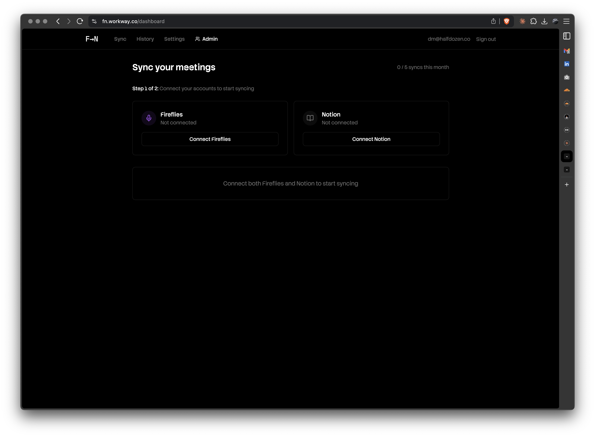
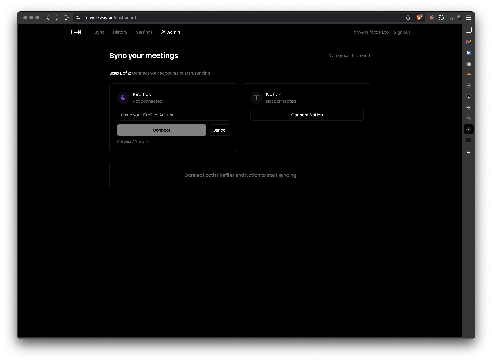
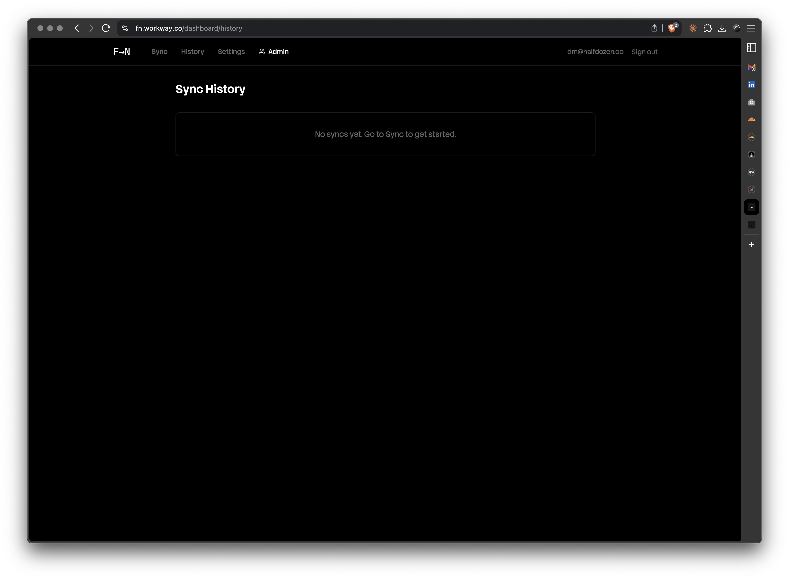
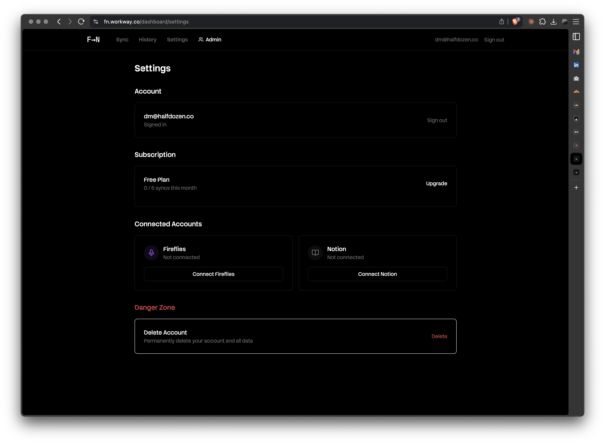
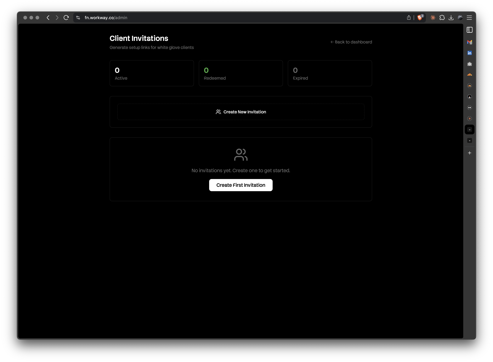
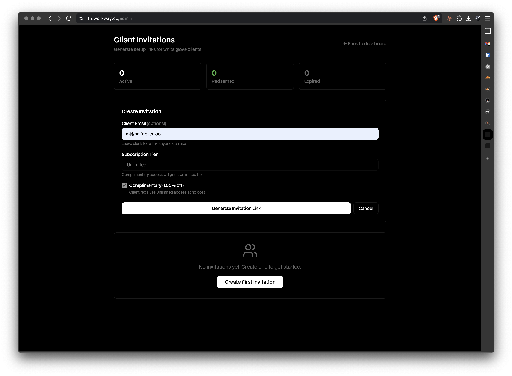
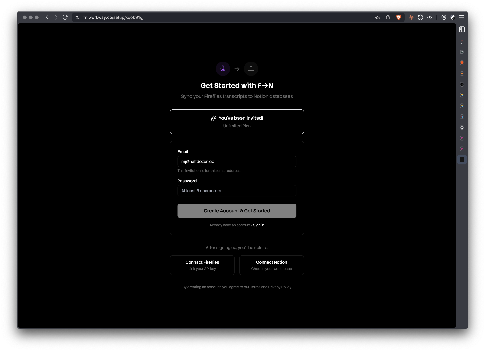

# F→N Admin Guide

> Sync Fireflies transcripts to Notion databases — not pages.

This guide covers the admin panel at `fn.workway.co/admin` for managing white glove client invitations.

---

## Quick Reference

| Page | URL | Purpose |
|------|-----|---------|
| Dashboard | `/dashboard` | Connect services, sync transcripts |
| History | `/dashboard/history` | View past syncs |
| Settings | `/dashboard/settings` | Account, subscription, connections |
| Admin | `/admin` | Create client invitations (Half Dozen only) |

---

## User Dashboard

### Step 1: Connect Your Accounts



Before syncing, connect both Fireflies and Notion:

1. **Fireflies**: Click "Connect Fireflies" to enter your API key
2. **Notion**: Click "Connect Notion" to authorize workspace access

The sync interface appears once both services are connected.

### Entering Your Fireflies API Key



1. Click "Connect Fireflies" on the dashboard
2. Visit [Fireflies Settings](https://app.fireflies.ai/integrations) to get your API key
3. Paste the key into the input field
4. Click "Connect"

### Sync History



The History tab shows all past syncs:
- Transcript name
- Sync date
- Status (success/failed)
- Notion page link

### Settings



The Settings page contains:

| Section | Purpose |
|---------|---------|
| **Account** | Your email, sign out |
| **Subscription** | Current plan, syncs used this month, upgrade option |
| **Connected Accounts** | Manage Fireflies and Notion connections |
| **Danger Zone** | Delete account permanently |

---

## Admin Panel (White Glove Clients)

The admin panel is available only to `@halfdozen.co` team members.

### Overview



The admin panel shows:

- **Stats cards**: Active, Redeemed, and Expired invitation counts
- **Create button**: Generate new invitation links
- **Invitation list**: All invitations with status

### Creating an Invitation



To create a client invitation:

1. Click "Create New Invitation"
2. Fill out the form:
   - **Client Email** (optional): Restrict invitation to specific email. Leave blank for anyone to use.
   - **Subscription Tier**: Free (5 syncs), Pro (100 syncs), or Unlimited
   - **Complimentary**: Check for 100% off — automatically grants Unlimited tier
3. Click "Generate Invitation Link"

**Note**: When "Complimentary" is checked, the tier selector is disabled and defaults to Unlimited.

### Sharing the Invitation Link


After creating an invitation:

1. The invitation appears in "Active Invitations"
2. Use the action buttons:
   - **Copy** (clipboard icon): Copy link to clipboard
   - **Open** (external link icon): Preview the setup page
   - **Delete** (trash icon): Revoke the invitation

The invitation shows:
- Client email (or "Any email" if unrestricted)
- Tier badge (free/pro/unlimited)
- Complimentary badge (if applicable)
- Time remaining (e.g., "7 days left")
- Creation date

### Client Setup Experience



When a client opens the invitation link:

1. They see "You've been invited!" with their plan (e.g., Unlimited)
2. Email is pre-filled (if specified during invitation creation)
3. They enter a password
4. Click "Create Account & Get Started"

**What happens next:**
- Account is created with the specified tier
- If Complimentary was checked, they have Unlimited access at no cost
- They're redirected to the dashboard to connect services

---

## Invitation Lifecycle

```
Created → Active → Redeemed
             ↓
          Expired (after 7 days if unredeemed)
```

| Status | Description |
|--------|-------------|
| **Active** | Link is valid, awaiting redemption |
| **Redeemed** | Client created account using link |
| **Expired** | 7 days passed without redemption |

Admins can revoke active invitations at any time.

---

## FAQ

**Q: Can I resend an invitation?**
No. Create a new invitation and share the new link.

**Q: What happens when Complimentary is checked?**
The client receives Unlimited tier at no cost. They never see pricing or payment prompts.

**Q: Can I change a client's tier after they redeem?**
Not currently through the admin panel. Contact support.

**Q: How long are invitations valid?**
7 days from creation.
